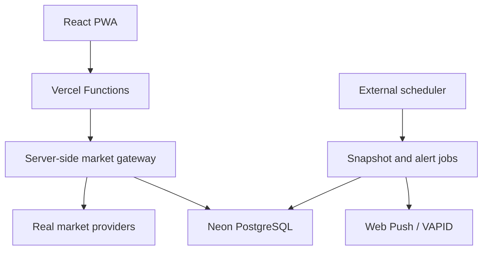

# Ayar

A production-grade, Turkish-first, mobile-first PWA for tracking gold and foreign exchange markets with real market data, interactive charts, portfolio analytics and server-side price alerts.

[Live Production Demo](https://ayar-vercel-ready-v0396-v04-hobbyfi.vercel.app)

> Ayar is a deployed portfolio case study. The production source repository is private; this public repository documents the product, architecture and engineering decisions without exposing application code or secrets.

## Product overview

### Gold mode

- Gram Gold/TRY market tracking
- ONS/USD and USD/TRY component view
- Interactive 1D, 1M, 3M and 1Y charts
- Market performance and 52-week position
- Local portfolio tracking
- Nominal and inflation-adjusted return analysis
- One-time and repeating price alerts
- Server-side alert history

### FX mode

- USD/TRY, EUR/TRY and GBP/TRY
- Interactive 1D, 1M, 3M and 1Y charts
- Currency-specific market summaries
- Server-side price alerts
- TRY, USD, EUR and GBP converter

### Shared experience

- Economic calendar
- iPhone Home Screen PWA support
- Background Web Push notifications
- System and data-source health view
- Honest fresh, stale, reference and unavailable states
- Mobile chart scrubbing and bounded tooltips
- iOS safe-area-aware navigation
- Dark and light appearance

## Core product principle

Ayar never fabricates live market data. If a provider becomes unavailable, the application reports cached, stale or unavailable data instead of presenting generated values as live prices. Bid/ask spreads are displayed only when a genuine quotation is available.

```text
Gram/TRY ≈ ONS/USD × USD/TRY ÷ 31.1034768
```

## Architecture



The browser communicates only with Ayar's backend. Provider selection, fallback logic and persistent last-good recovery remain server-side.

## Technology stack

| Layer | Technology |
| --- | --- |
| Frontend | React 19, Vite |
| Charts | Recharts |
| Backend | Vercel Functions |
| Database | Neon PostgreSQL |
| Notifications | Web Push, VAPID |
| Scheduling | External cron jobs |
| Testing | Vitest |
| Runtime | Node.js 22 |
| Delivery | GitHub to Vercel production deployment |

## Engineering highlights

### Real market-data pipeline

- A single server-side gateway controls provider selection.
- Intraday history is persisted as real market snapshots.
- Long-range history is built from genuine historical series.
- Persistent last-good records are exposed only as stale data.
- Market responses include source, observation time and freshness metadata.
- Thirty-day tick retention prevents unbounded database growth.

### Reliable price alerts

- The server is the single authority for alert evaluation.
- Alerts trigger only after a genuine price crossing.
- Stale or reference prices cannot trigger an alert.
- One-time targets are deactivated server-side.
- Repeating alerts include cooldown protection.
- Successful triggers are stored in alert history.
- Background notifications work when the installed PWA is closed.

### Mobile chart interaction

- Deterministic, evenly spaced date ticks
- Touch and drag price inspection
- Corrected chart coordinate mapping
- Custom selected-point rendering
- Mobile tooltip boundary protection
- Stable 1D, 1M, 3M and 1Y ranges

### PWA stability

- Network-first navigation with shell fallback
- Market API responses excluded from runtime CacheStorage
- Versioned service-worker cache and recovery namespace
- Foreground update checks after reconnect or visibility changes
- Production strategy designed around iPhone Home Screen usage

### Security and data integrity

- Content Security Policy and browser security headers
- Explicit API method allowlists
- Request body limits and strict input validation
- HTTPS-only push endpoints with local/IP-literal rejection
- Server-only secrets
- PostgreSQL primary key, foreign key, unique and CHECK constraints
- Production data integrity audit completed with zero violations

## Production verification

Release `v1.4.0` was verified with:

- 30 passing test files
- 149 passing automated tests
- Successful Vite production build
- Healthy production database connection
- Fresh Gold, USD, EUR and GBP feeds
- Working snapshot and alert schedulers
- Configured Web Push
- Ready alert-history infrastructure
- Validated database integrity constraints
- No runtime errors detected during release verification

## Product status

Ayar is live as an installable PWA and is maintained as a production-grade portfolio project.

Current release: `v1.4.0`

## Screenshots

Product screenshots and a short interaction walkthrough will be added to this showcase repository.

## Author

Developed by [Orkun Kutay Ağca](https://github.com/orkunkutayagca).

## Disclaimer

Ayar provides reference spot-market information and personal portfolio calculations. It does not provide investment advice, brokerage services or executable trading.
